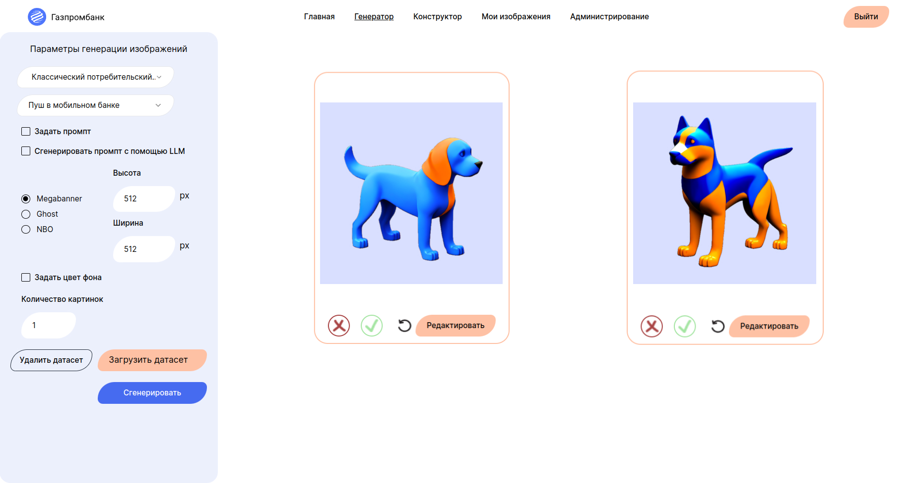

# Сервис генерации маркетинговых изображений
## Команда Каши Сиквенс МИСИС

### Ссылка на прототип в документации, так же в документации более подробное описание продукта

### Продукт 

Наша задача состояла в разработке сервиса генерации изображений. Минимальный функци-
онал сервиса - принимать на вход данные о пользователе Банка и генерировать персонали-
зированное изображение.

Наш сервис обладает следующим функционалом: 
* Авторизация, 
* Регистрация, 
* Генерация изображений (с большим количеством параметров), 
* Конструктор изображений (редактор), 
* Просмотр сгенерированных изображений, 
* Просмотр изображений по категориям, 
* Просмотр Топа Изображений, 
* Панель администратора, 
* Разметка успешности/неуспешности генерации

### Ноутбуки с обучением и экспериментами

 * [Обучение LoRA](./notebooks/Обучение%20LoRA.ipynb)
 * [Эксперименты подбор модели](./notebooks/FineTuningSBv1_5_Эксперименты_Подбор_модели.ipynb)
 * [Эксперименты подбор модели Дистилляция](./notebooks/Эксперименты%20Подбор%20модели%20Дистилляция.ipynb)
 * [Генерация датасета](./notebooks/genetate-dataset.ipynb)
 * [Заполнение цветом](./notebooks/color-fill.ipynb)
 * [Форматы фотографий](./notebooks/Форматы_фотографий.ipynb)
 * [Сравнение моделей](./notebooks/model-comparison.ipynb)
# Запуск 

**Администратор:**  
Логин: `admin@admin.com`  
Пароль: `admin`  

**Тестовый пользователь:**  
Логин: `test@test.com`  
Пароль: `test`  

## Локальный запуск

1. `git clone https://github.com/Artem216/lct-2024`  
2. `cd lct-2024`  
3. `cd /backend/api-service/app`  
4. `sudo vim .env` (есть пример в `.env.example`)  
5. `cd ../../ml/app`  
6. `sudo vim .env` (есть пример в `.env.example`)  
7. `cd ../../../`  
8. Скачать веса моделей и поместить их в папку `lct-2024/backend/ml/weights`  
9. `sudo docker compose up --build -d`  

Интерфейс будет доступен по адресу: `http://localhost:5173`

## Инструменты
Frontend  
1. React, Typescript  
2. Konva, shadcn/ui  
Backend  
1. Python - API сервис  
2. PostgreSQL - база данных  
3. S3 - база данных  
3. Kafka - брокер сообщений  

## Состав команды
Николай Александров - Data Scientist  
Сергей Мартынов - Data Scientist  
Мария Ульянова - Data Scientist  
Артем Цыканов - Backend  
Надежда Анисимова - Data Scientist, Frontend  
