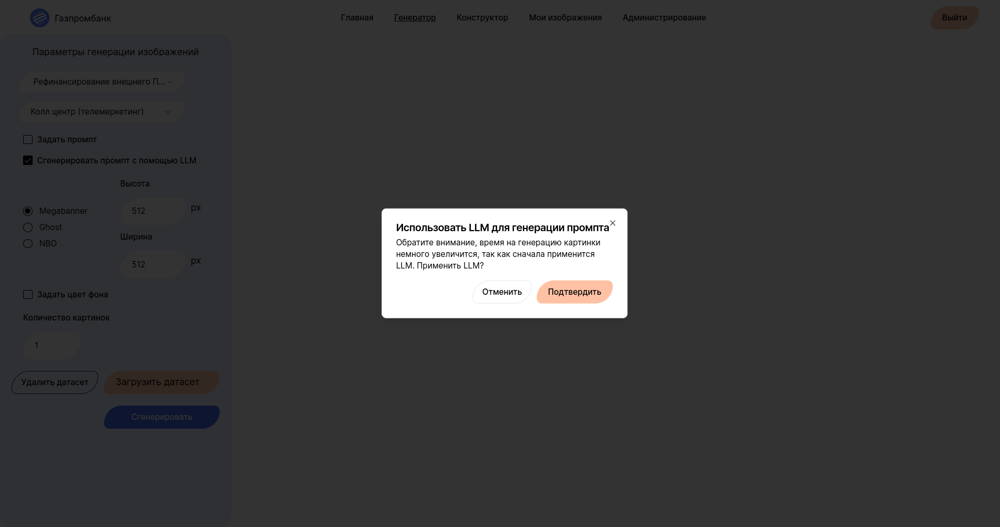

# Сервис генерации маркетинговых изображений
## Команда Каши Сиквенс МИСИС

### Ссылка на прототип в документации, так же в документации более подробное описание продукта

### Продукт 

Наш сервис обладает следующим функционалом: 
* Авторизация, 
* Регистрация, 
* Генерация изображений (с большим количеством параметров), 
* Конструктор изображений (редактор), 
* Просмотр сгенерированных изображений, 
* Просмотр изображений по категориям, 
* Просмотр Топа Изображений, 
* Панель администратора, 
* Разметка успешности/неуспешности генерации

### Ноутбуки с обучением и экспериментами

 * [Обучение LoRA](./notebooks/Обучение%20LoRA.ipynb)
 * [Эксперименты подбор модели](./notebooks/FineTuningSBv1_5_Эксперименты_Подбор_модели.ipynb)
 * [Эксперименты подбор модели Дистилляция](./notebooks/Эксперименты%20Подбор%20модели%20Дистилляция.ipynb)
 * [Генерация датасета](./notebooks/genetate-dataset.ipynb)
 * [Заполнение цветом](./notebooks/color-fill.ipynb)
 * [Форматы фотографий](./notebooks/Форматы_фотографий.ipynb)
 * [Сравнение моделей](./notebooks/model-comparison.ipynb)

